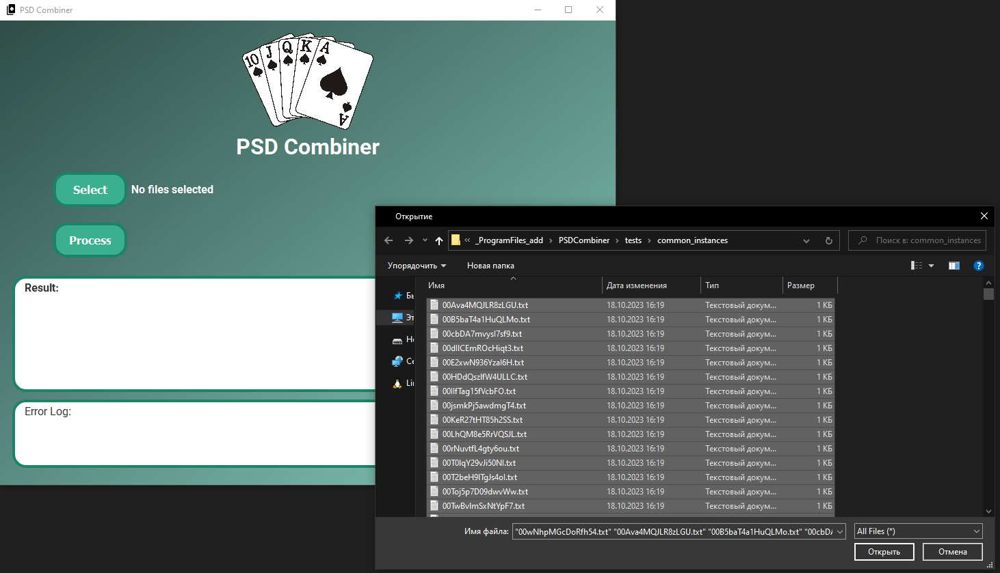
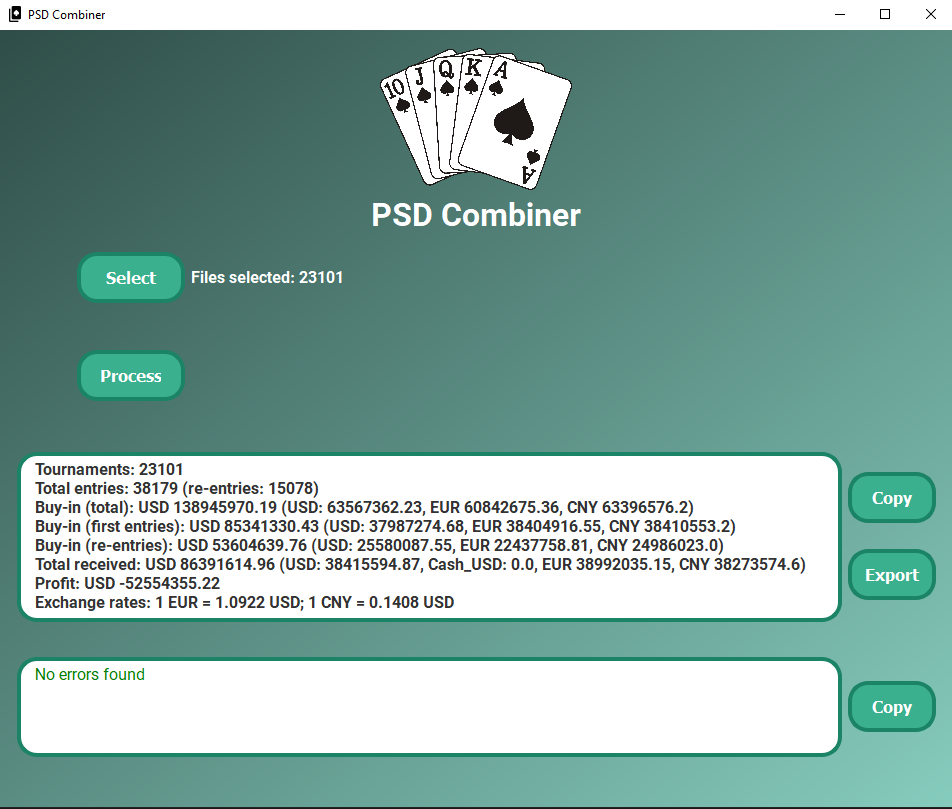
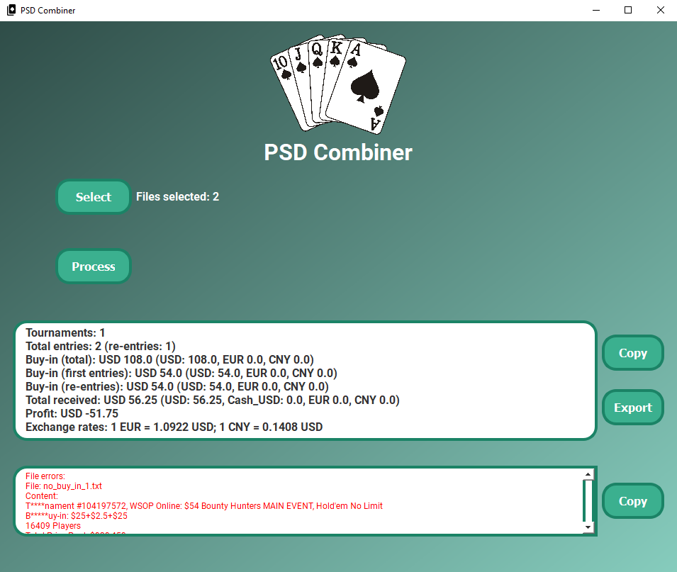
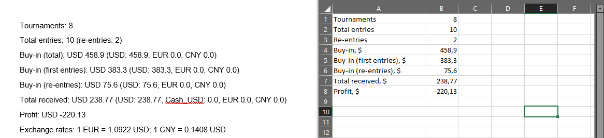

# PSDCombiner

**PSDCombiner** designed for convenient synthesis of poker session data. The application allows simultaneous upload 
of up to 30,000 files, after which, in accordance with pre-set templates, the files will be quickly recognized.

Data from the files will be grouped, and a final statistics summary for all files will be generated, which 
can be exported in both text and tabular formats. 

In the event that a file is not recognized or an error occurs, the user will be notified in detail separately.

[//]: # (Это приложение разработано для удобного синтеза данных покерных сессий.)

[//]: # (В приложение можно единовременно загрузить до 30 000 файлов, после чего в соответвии с заранее предустановленными шаблонами файлы быстро будут распознаны.)

[//]: # (Данные из файлов будут сгруппированы и будет подведена итоговая статиска по всем файлом, которую можно будет вывести как в текстовом формате, так и в формате, пригодном для добавления в таблицу.)

[//]: # (В случае, если файл не будет разпознан или возникнет иная ошибка, об этом пользователю будет подробно сообщено отдельно.)
___

## Technologies

[](https://www.python.org/downloads/release/python-31012/)
[](https://doc.qt.io/qt.html#qt5)

[](https://github.com/)

___

## Installation

Run the following commands to bootstrap your environment.

For Windows:

```commandline
git clone https://github.com/rYauheni/psd_combiner.git

python -m venv venv
venv\Scripts\activate

pip install -r requirements.txt
```

For Linux:

```commandline
git clone https://github.com/rYauheni/psd_combiner.git

python3 -m venv venv
source venv/bin/activate

pip install -r requirements.txt
```

___

## QuickStart for development

For Windows:

   ```commandline
   python main.py
   ```

For Linux:

   ```commandline
   python3 main.py
   ```
___

## Launch for production

### Created `.exe` file

For Windows:

   ```commandline
   python setup.py build
   ```

For Linux:

   ```commandline
   python3 setup.py build
   ```

 ___

## Demo

### Add files


### Parse


### ErrorLog


### Output options



## Contributing

Bug reports and/or pull requests are welcome
___
